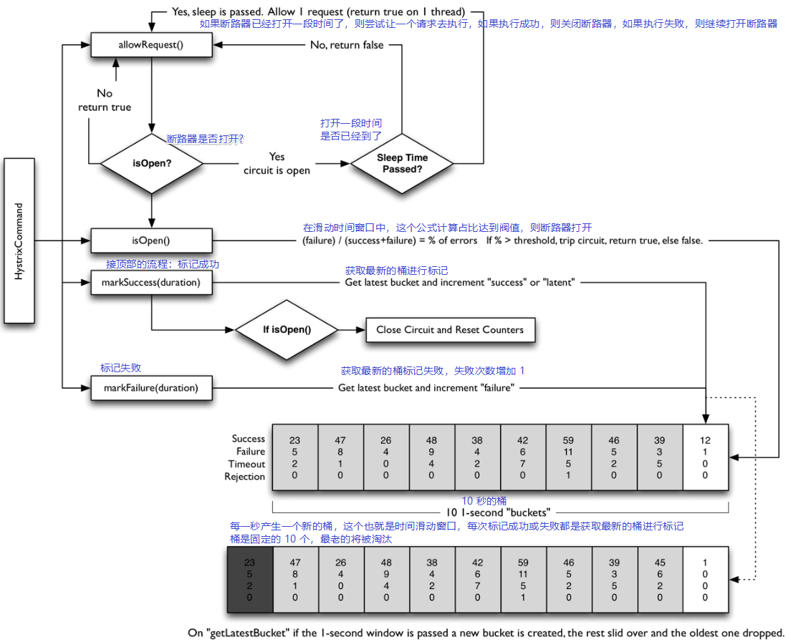

# 096. 深入理解 hystrix 的短路器执行原理以及模拟接口异常时的短路实验

## 断路器开关的条件与工作原理
断路器的打开是多方度量的结果，受以下几方面影响

1. 断路器上的流量达到某个阀值

    `HystrixCommandProperties.circuitBreakerRequestVolumeThreshold()`

    所有的调用都会经过断路器，它才能统计经过的流量
2. 统计到异常占比达到某个阀值

    `HystrixCommandProperties.circuitBreakerErrorThresholdPercentage()`

3. 断路器从关闭（closed）状态到打开（open）状态
4. 经过一段时间 `HystrixCommandProperties.circuitBreakerSleepWindowInMilliseconds()` 后

    下一个请求如果通过（这个时候是半开状态（half-open）），断路器则关闭；
    如果下一个请求失败，那么断路器将变成 open 状态，继续等待该配置时间后，再次尝试半开状态；

它的流程图大体是这样，10 秒是一个时间窗口



比如：10 秒内请求流量需要达到 10（默认值是 20 ） 个，并且异常占比 50%，也就是有 5 个请求
异常了，那么断路器就会开启。当开启 3 秒后，会允许一个请求通过，如果成功，则关闭断路器

## 测试断路器效果

把上面的比如描述，变为代码如下

```java
public class CommandCircuit extends HystrixCommand<String> {

    private final boolean throwException;

    public CommandCircuit(boolean throwException) {
        super(Setter.withGroupKey(HystrixCommandGroupKey.Factory.asKey("test"))
                .andCommandPropertiesDefaults(
                        HystrixCommandProperties.Setter()
                                // 10 秒时间窗口流量达到 10 个；默认是 20
                                .withCircuitBreakerRequestVolumeThreshold(10)
                                // 当异常占比超过 50% ；默认值是 50
                                .withCircuitBreakerErrorThresholdPercentage(20)
                                // 断路器打开之后，后续请求都会被拒绝并走降级机制，打开 3 秒后，变成半开状态
                                .withCircuitBreakerSleepWindowInMilliseconds(3000)
                )
        );
        this.throwException = throwException;
    }

    @Override
    protected String run() {
        if (throwException) {
            throw new RuntimeException("failure from CommandThatFailsFast");
        } else {
            return "success";
        }
    }

    @Override
    protected String getFallback() {
        return "降级机制";
    }
}
```

测试

```java
@Test
public void test() throws InterruptedException {
    for (int i = 0; i < 1000; i++) {
        CommandCircuit commandCircuit = new CommandCircuit(i % 2 == 0);
        TimeUnit.MILLISECONDS.toMillis(500);
        System.out.println(i + " - " + commandCircuit.execute());
    }
    TimeUnit.SECONDS.sleep(3);
    System.out.println("3 秒之后，断路器变成半开状态，一个请求通过");
    CommandCircuit commandCircuit = new CommandCircuit(false);
    System.out.println(commandCircuit.execute());
    System.out.println("断路器关闭，尝试访问");
    for (int i = 0; i < 3; i++) {
        CommandCircuit c = new CommandCircuit(false);
        System.out.println(c.execute());
    }
}
```

输出日志

```
22:57:29.155 [hystrix-test-3]
0 - 降级机制
1 - success
22:57:29.461 [hystrix-test-10]
318 - 降级机制
319 - success
...
320 - 降级机制
321 - 降级机制
999 - 降级机制
3 秒之后，断路器变成半开状态，一个请求通过
success
断路器关闭，尝试访问
success
success
success
```

对于测试代码来说，不太好控制，可能是没有理解那个 10 秒桶滑动时间窗口，
只能这种在短时间内产生大量请求，然后异常。

从日志中分析，在 22:57:29 秒钟产生了大量的请求，异常占比肯定达到了阀值，在当前的时间 10 秒
滑动时间窗口中满足了条件，断路器被打开。在休眠 3 秒后，由于这 3 秒没有产生任何请求，半开状态也通过，断路器就关闭了

## 断路器相关配置

```java
super(Setter.withGroupKey(HystrixCommandGroupKey.Factory.asKey("test"))
        .andCommandPropertiesDefaults(
                HystrixCommandProperties.Setter()
                        // 手动控制断路器是否启用
                        .withCircuitBreakerEnabled(true)
                        // 10 秒时间窗口流量达到 10 个；默认是 20
                        .withCircuitBreakerRequestVolumeThreshold(10)
                        // 当异常占比超过 50% ；默认值是 50
                        .withCircuitBreakerErrorThresholdPercentage(20)
                        // 断路器打开之后，后续请求都会被拒绝并走降级机制，打开 3 秒后，变成半开状态
                        .withCircuitBreakerSleepWindowInMilliseconds(3000)
                        // 手动强制控制断路器是否打开
                        .withCircuitBreakerForceClosed(true)
                        .withCircuitBreakerForceOpen(true)
        )
);
```
