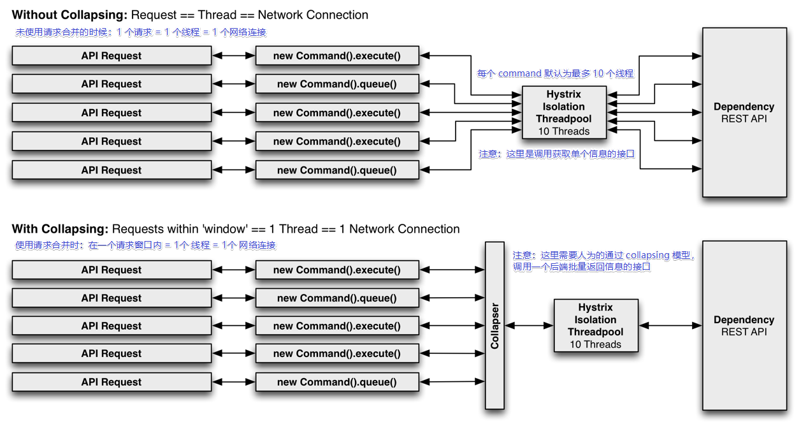
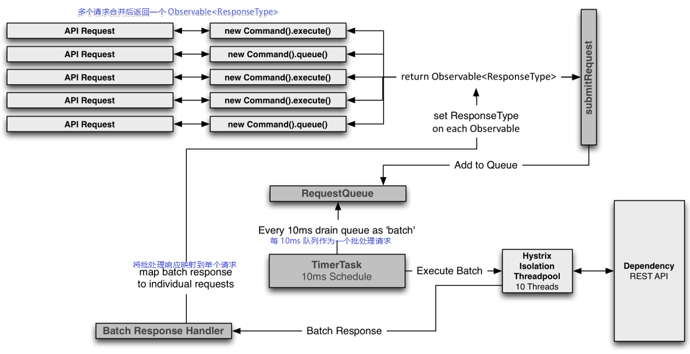

# 100. 基于 request collapser 请求合并技术进一步优化批量查询
hystrix 高级的技术：request collapser（请求合并技术，直译为 collapser 折叠）

## 请求合并原理 - 官网
> [官网 request collapser 直达](https://github.com/Netflix/Hystrix/wiki/How-it-Works#request-collapsing)

使用 HystrixCollapser 类型的 HystrixCommand 来实现请求合并，
可以实现将多个请求合并为对后端依赖服务的单个调用

怎么理解上面的话？先看下面的图，在线程数量和网络连接数量上的比较

### 为什么要使用 request collapser？
上面的图片是否是看得不太懂？

来简述下上图的含义：

1. 当使用普通单个请求 command 时：1个 请求 = 1个 线程 = 1个 网络连接

    比如：在 10 毫秒内，有 20 个并发请求，那么此时如果没有设置等待队列的话，应该只会有 10 个请求执行成功，剩下 10 个被拒绝了
2. 当使用请求合并 command 时：在一个请求窗口内 = 1个 线程 = 1个 网络连接

    比如：在 10 毫秒内，有 20 个并发请求，那么此时如果没有设置等待队列的话，那么可能只会占用 2 个请求线程

上面的解释之后是否比较有一点感觉了？至于你现在更多的问题，在后面示例代码之后，就会明白这个功能实现的原理了

使用请求合并来减少并发执行 HystrixCommand 执行所需的线程数和网络连接数。而且请求合并是自动的，不会强制你手动协调合并哪些请求。

### 请求合并的多种级别

- global context

    tomcat 所有调用线程，对一个依赖服务的任何一个 command 调用都可以被合并在一起，hystrix 就传递一个 HystrixRequestContext

    对于这一级别，没有更多的解释，官方推荐使用下面的那一个
- user request context

    tomcat 内某一个调用线程，将某一个 tomcat 线程对某个依赖服务的多个 command 调用合并在一起

    此种方式在前面 [request cache](./094.md) 中已经演示过怎么配置请求上下文了

    此种级别是 hystrix 默认级别
- object modeling 基于对象的请求合并

    如果有几百个对象，遍历后依次调用每个对象的某个方法，可能导致发起几百次网络请求，基于 hystrix 可以自动将对多个对象模型的调用合并到一起

    此方式也不推荐使用，没有更多的描述
上面的一个能实现的重要点是：使用请求合并 command 的时候，是需要单独提供一个批量获取数据的接口。 hystrix 负责把某一个时间窗口内的 command 合并成一个 collapser ，然后由你去调用这个批量获取数据接口

### 请求合并的代价是多少？
使用请求合并技术最大的代价就是：导致延迟大幅度增强，因为需要将一定时间内的多个请求合并

比如：发送 10 个请求，每个请求大概是 5 毫秒可以返回，要把 10 个请求合并在一个 command 内，统一执行，那么就有一个等待时间，假设是 10 毫秒，执行时间就可能变成 15 毫秒，延迟了 10 毫秒；通常情况下请求不会恰好在等待时间到达刚好 10 毫秒的时候才发出去请求，所以延迟还可以降一半，本例子为 5ms。

这个延迟开销是否是有意义的取决于正在执行的 command，并且与并发数量也有关系，因为有两个策略会触发合并请求发出去，一个是请求达到阀值，一个是等待时间达到阀值。请求合并并不适合在单线程中等待执行，这样会加大延迟。

比如 10 个请求单个数据总耗时将花费 50 毫秒，平均 5 毫秒；当并发 10 线程请求的时候，那么只需要 5 毫秒即可拿到数据；
同样，为了尽快达到合并发出请求阀值，在并发下会更快的达到阀值，批量请求数据可能需要耗时 10 毫秒。

总起看起来，不合并至需要 5 毫秒，合并之后可能需要 15 毫秒（10 毫秒请求接口，因为是批量数据的接口，假设会比单个耗时一点 + 5 毫秒的等待时间）

那么好处是什么呢？单个接口获取数据与批量接口获取数据去掉获取数据的时间因素（往往是业务聚合等因素），那么就是网络开销了；
如果特定命令同时大量使用并且可以将数十个甚至数百个调用一起批量处理，那么由于 Hystrix 减少了所需的线程数量和网络连接数量，因此实现的吞吐量通常远远超过了这个代价

所以总结：请求合并适合在高延迟 + 大量并发的情况下使用

- 每个请求就 2ms，batch 需要 8~10ms，延迟增加了 4~5 倍
- 每个请求本来就 30ms~50ms，batch 需要 35ms~55ms，延迟增加不太明显

### 请求合并流程

1. hystrix 会在 10ms（默认）内等待一批请求
2. 到达 10ms 时会将此次时间内收集到的单个请求合并调用一个批处理接口
3. 批处理响应返回后，需要为每个请求设置响应映射，不然怎么分得清楚哪个请求了什么？

原理和流程，优缺点了解了，但是感觉还是有点懵逼，没有关系，看看例子

## Request Collapsing 请求合并例子 - 官网
> [官网直达](https://github.com/Netflix/Hystrix/wiki/How-To-Use#request-collapsing)
