# float 浮动

本节能学到的知识:

通过追溯CSS/HTML发展历史，知道Float出现的原本作用是什么，从而可以帮助我们解答很多疑惑。

## 1. float 的历史

设计的初衷不是为了高大上的布局，而仅仅是文字环绕效果。 （文字环绕图文），可以感受 [文字环绕效果感受](https://github.com/zq99299/css-zxx/tree/master/float/1-2) ，记得需要先看问题的效果，再去看解决后的效果，就有直观的感受了

## 2. 包裹与破坏

增强浮动的感性认知，让我们更好更快的理解一些特性

### 包裹

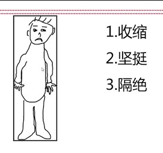


- 收缩：只会在容器内，被包裹住
- 坚挺：之前没有高度，现在高度和容器一样高
- 隔绝：里面的人发生任何的事情，对外面都没有任何的影响，这种特性称为 **BFC（Block formatting context 块级格式化上下文）**

::: tip 特别注意
包裹性是指把 float 施加到父元素上，父元素会包裹住子元素
:::

### 具有包裹性的其他元素

- `display:inline-block/table-cell/...`

- `position:absolute/fixed/sticky`

  absolute 近亲，这个在 absolute 章节讲解

- `overflow:hidden/scrool`

  给父元素增加 overflow: hidden;（宽度要是固定或则100%（块级元素宽度默认就是100%））

    > 原理：使用了overflow:hidden 的父元素要计算超出的部分然后进行隐藏，那么他就会撑开自身把所有的子元素包裹进来。 --  来自百度不权威的解说

  

### 破坏

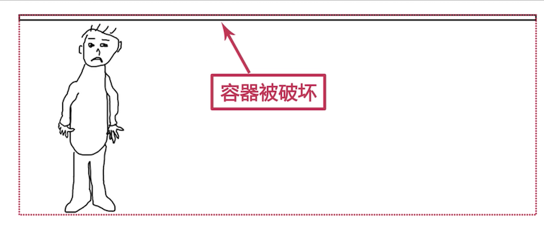

没有 float 之前，父容器被这个小人高度撑开，增加 float 后，容器被破坏，它的表现就是：脱离文档流，让父元素的高度塌陷

### 具有破坏性的其他元素

- `display:none`
- `position:absolute (近亲)/fixed/sticky`


因此：浮动是魔鬼，三无准则：无宽度、无图片、无浮动

::: tip 特别注意
破坏性是指把 float 施加到子元素上，父元素高度塌陷
:::

## 3. 被误解的 float 浮动

**浮动使高度塌陷不是 Bug，而是标准**

在当时 CSS 盒模型的基础上，要这么才能让文字环绕图片？设计者很巧妙的使用了破坏熟悉（关于盒模型是个很庞大的概念，自己去深入理解），下面用一个小图来讲解

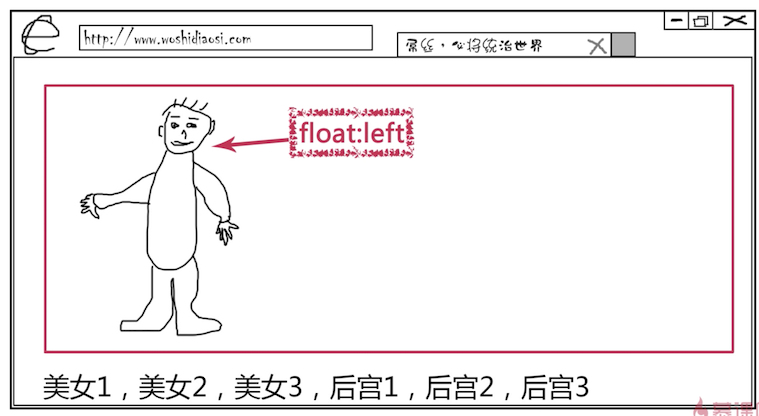

大哥被限制在红框中了，为了放荡一下，给自己增加了 float 属性，然后可见，开始靠边站、并且容器高度塌陷，由于塌陷，下面的美女元素就自动靠在图片后面了

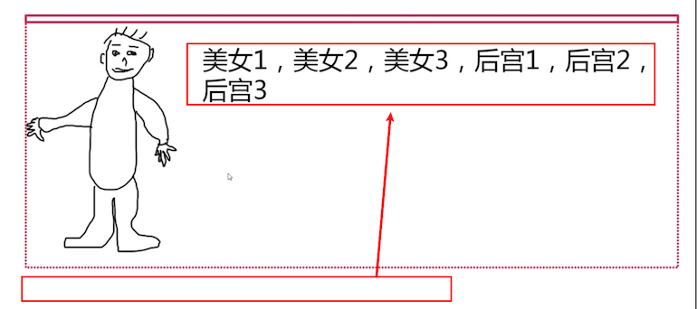


下面再来看一个图片理解浮动

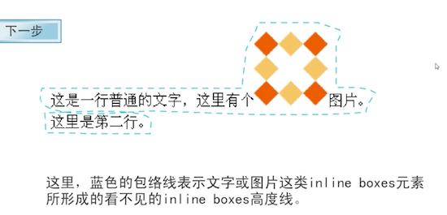

对图片施加 `float:left` 后，破坏了容器高度

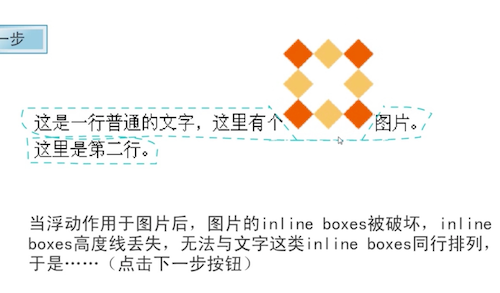

并且浮动具有偏移的特性，偏移到了左侧

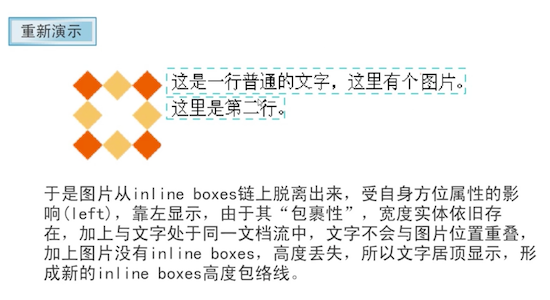

### 结论

浮动的破坏性只是单纯为了实现文字环绕效果而已，因此：父容器高度塌陷根本就不是 BUG，是 **特性**

## 4. 清除浮动

清除浮动的目的是 **清除浮动带来的影响**

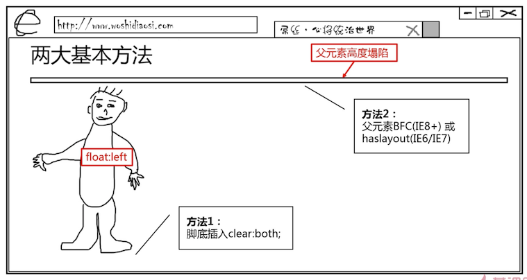

有两大基本方法：

- 在脚底插入 `clear:both;`
- 让父元素 BFC（高级浏览器的特性），低级浏览器使用 haslayout

### 方法差异

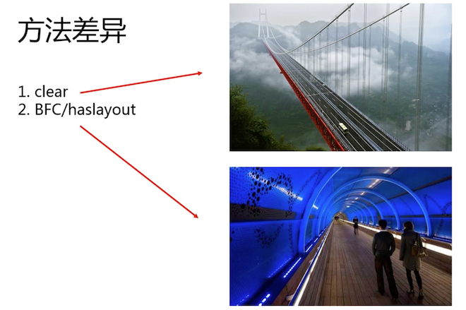


- clear：就如同在峡谷两侧搭建了索道，可以正常通行，但是可以和外界有 **接触**，并且发生，环境重叠效果

- BFC：产生了一个封闭的结构，不会产生重叠，例如浮动，让文字环绕它，而不是重叠它


## clear 通常应用形式

- HTML block 水平元素底部

  如：`<div></div>`，

  缺点：有很多裸露的 div 标签站位

- CSS after 伪元素底部生成

  `.clearfix:after{}`

  缺点：低版本浏览器 IE6/7 不支持

### BFC/haslayout 通常声明

让标签产生 BFC 的属性有如下常用的：

- `float:left/right`
- `position:absolute/fixed`
- `overflow:hidden/scroll(IE7+)`
- `display:inline-block/table-cell(IE8+)`
- `width/height/   zoom:1(可以让 IE6/IE7 产生 haslayout)`

这只是其中一部分，还有其他的自行了解

以上声明的不足：

- 无法 "一方通行"：你不能保证每个元素都施加这些声明
- 兼容性问题：zoom 可以一方通行，但是仅限于 IE 浏览器

那么经过权衡利弊之后，使用以下代码来达到清除浮动的效果

```css
// ie8 以上 .clearfix 是塌陷的元素
.clearfix:after{content:'';display:block;height:0;overflow:hidden;clear:both}
// 该方法也是可以的，代码更简洁了;省略了很多声明
.clearfix:after{content:'';display:table;clear:both}

// ie6/7
.clearfix {*zoom:1;}
```

### 浮动的滥用

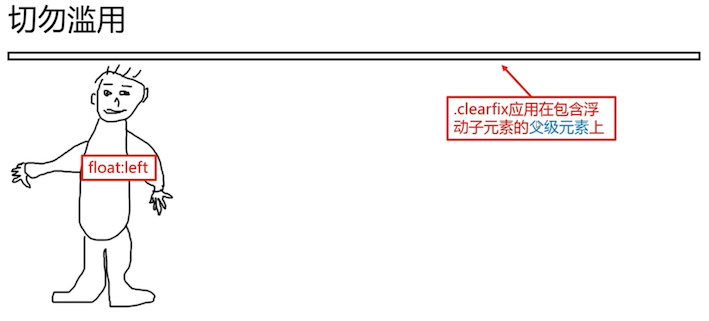


你只应该将 `.clearfix` 应用在包含浮动子元素的 **父级元素** 上

滥用不只是浪费的问题，而是会让乱入的 haslayout 在 ie6/7 上做出出格的事情，因为浮动也会触发 haslayout ，所以浮动在 ie6/7 下回显得很魔性

### clear 与 margin 重叠

这个是一个[感受题，注意仔细观察体验](https://github.com/zq99299/css-zxx/tree/master/float/1-2 )，请前往查看尝试效果

## 5. 浮动的滥用

不在其职而谋其政，我本流体布局生，无奈苦逼砌砖头

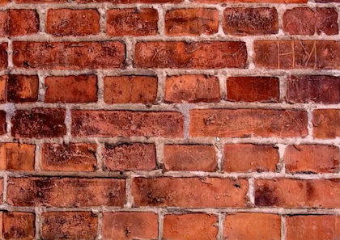

一块一块的砖头，可以堆一堵墙出来。

### 为啥浮动可以用来砌砖头?

- 元素 block 块状化（砖头化）：[浮动与display:block化 demo 演示](https://github.com/zq99299/css-zxx/tree/master/float/5/浮动与display:block化.html)

  原本不是 block 的元素，被施加了 float 后，会变成 block 的

- 破坏性造成的紧密排列特性（去空格化）

  让元素环绕，空格、换行符也属于元素


#### 去空格化

[浮动去空格 demo 演示 1](https://github.com/zq99299/css-zxx/tree/master/float/5/浮动去空格.html)


去掉换行产生的间隔，发现下面的 P 标签的距离和上面的重叠了

[浮动去空格 demo 演示 2](https://github.com/zq99299/css-zxx/tree/master/float/5/浮动去空格2.html)

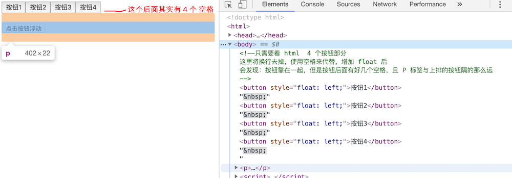

换行和空格，被 float 后，4 个 **空格跟随在了按钮后面**，还记得浮动的特质吗？**文字环绕！** 

他们效果是有区别的，可以看到图片上面两个按钮离上排的距离不一样，**导致这个的原因是**：

- 使用换行符与空格一样，会被跟随在按钮后面，**但是换行符看不见也不能选中**，它占据的空间很少，可以看到第一个 demo 中的按钮仅靠在上排的
- 使用换行符就不一样了，换行符是可以被选中的，它是占据空间的，所以下排的按钮靠不上去

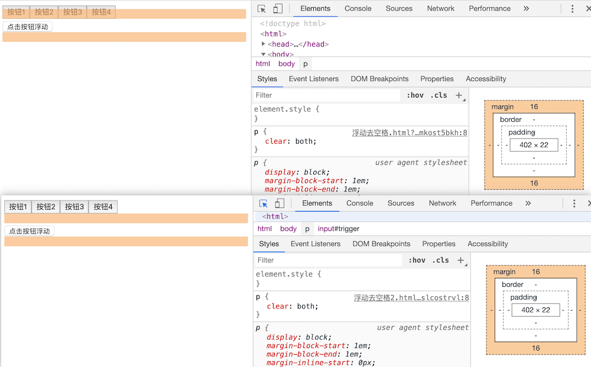

根据浏览器的盒模型来看，P 标签有上下的 margin 16 ，由于换行符不占据空间，下排的按钮几乎上是贴着上排的按钮的，这里是否也是由于 margin 值被重叠的缘故，导致 margin 穿透了呢？

#### 砖头是如何砌起来的

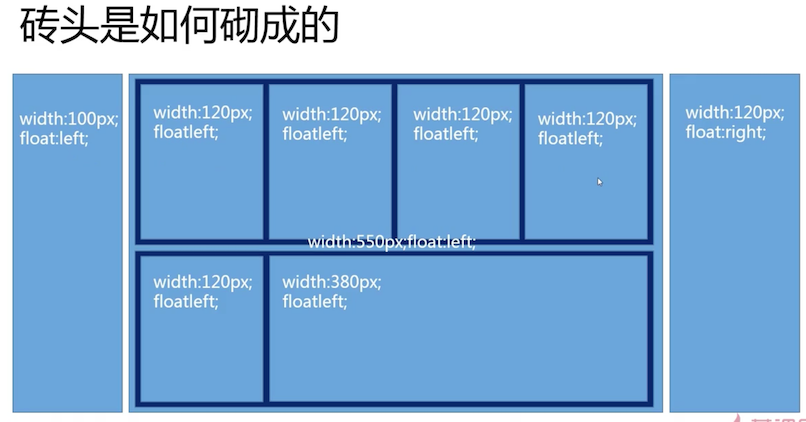

可以看到，利用浮动的块状化、去空格化 就想现实世界中搭积木一样简单好用，着也是浮动被乱用的原因之一

### 砌砖布局的问题

1. 妙脆角-嘎吱脆：容错性交叉，容易出问题，比如错位
2. 吝啬鬼-重用废：这种布局需要元素固定尺寸，很难重复使用
3. 洋葱头-IE7 飙泪：在低版本的 IE 下问题很多

还有其他的问题，所以尽量少使用该布局

## float 与流体布局

我本流体布局生，春江流水应犹在：float 设计就是为了文字环绕，文字环绕也就是 **流体布局**，因此要把浮动使用在流体布局中，才是发挥它的优势

### 看家本领-文字环绕

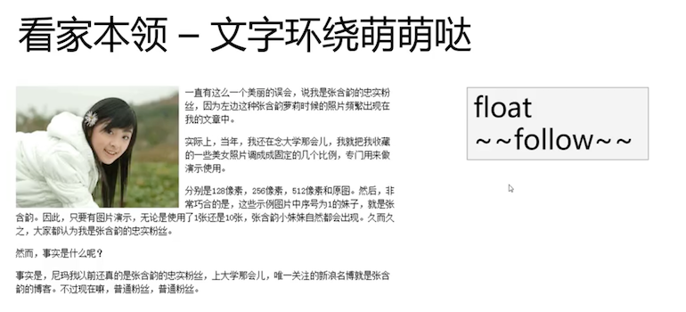

float 的看家本领就是文字环绕，float 后跟随着许多跟随元素

### 文字环绕变声-左青龙右白虎

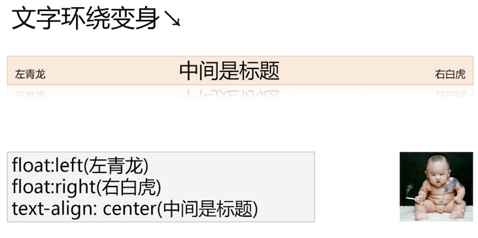

[文字环绕变身-左青龙右白虎 demo 演示 ](https://github.com/zq99299/css-zxx/tree/master/float/6/文字环绕变身-左青龙右白虎.html)

注意，上述的顺序，文字只能在后面，前面两个浮动后，文字才会跟随上去，否则会造成，右白虎前面有文字，看起来掉在了下一行

### 文字环绕衍生-单侧固定

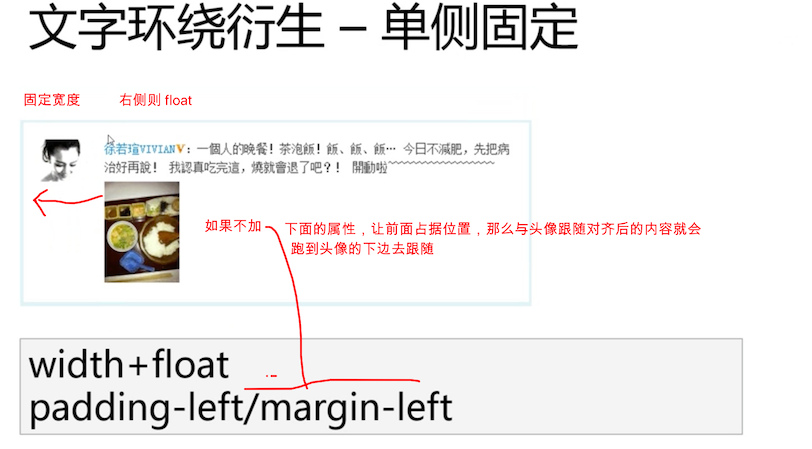

[浮动与单侧尺寸固定的流体布局 demo 演示 ](https://github.com/zq99299/css-zxx/tree/master/float/6/浮动与单侧尺寸固定的流体布局.html)

上图中，上面的实现标识了两种：

- 传统的实现：
  - 左侧固定宽度 + 左浮动
  - 右侧固定宽度 + 右浮动
- 文字环绕流布局实现：
  - 左侧固定宽度 + 左浮动
  - 右侧利用跟随自适应+ 占位（不会跑到头像下面去）

### DOM 与显示位置匹配的单侧固定布局

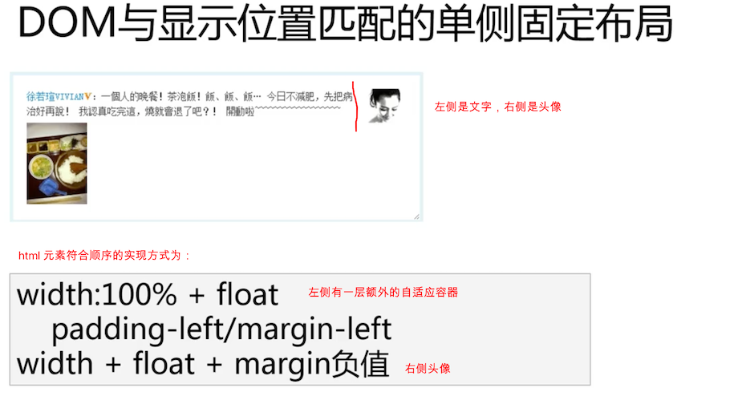

- 页面视觉与 DOM 元素相反的实现
  - 头像区域：右浮动 + 宽度固定
  - 内容区域：由于位置本身就在后面，环绕文字； + margin-rigft ；
- 页面视觉与 DOM 元素一致的实现
  - 内容区域：一个额外的容器进行宽度 100% 自适应 + 左浮动
  - 头像区域：
    - 左浮动，跟随内容区域，由于内容区域 100% 宽度，导致头像往下掉
    - 利用 margin-left 负值达到显示在同一行中

[浮动与单侧尺寸固定的流体布局 demo 演示 ](https://github.com/zq99299/css-zxx/tree/master/float/6/浮动与右侧尺寸固定的流体布局.html)

### 高级进化-智能自适应尺寸

左右两边都可以自适应

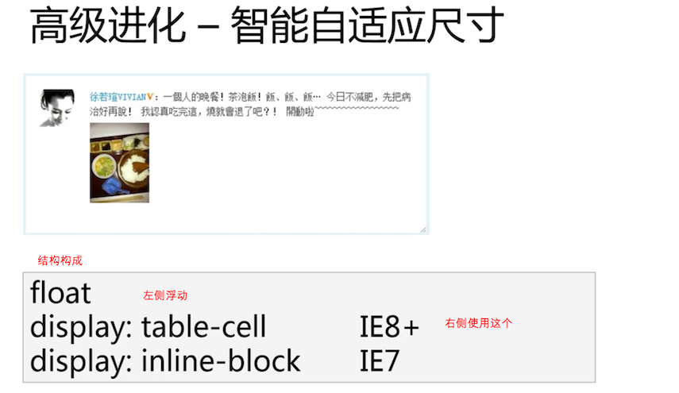

[浮动与两侧皆自适应的流体布局 demo 演示 ](https://github.com/zq99299/css-zxx/tree/master/float/6/浮动与两侧皆自适应的流体布局.html)，实现方式：

- 头像：左浮动
- 内容：使用 `display: table-cell` 

达成头像宽度更改，内容自适应；

有一个不是问题的问题：当整个面变宽度特别小的时候，内容会掉在头像下面，因为正常来说都不会达到这么窄的情况

等等还有很多其他的布局应用，这里不再继续

## float 与兼容性

IE 6 太古老不兼容太多，不要管了。

### 让 IE7 飙泪的浮动问题

- 含 clear 的浮动元素包裹不正确的问题

- 浮动元素倒数 2 个莫名其妙垂直间距的问题

- 浮动元素最后一个字符重复的问题

- 浮动元素楼梯排列问题

- 浮动元素和文本不在同一行的问题

  前面几个 BUG 太匪夷所思，直接忽略掉，这一个可能会常见。

  ```html
  <div>
    文字标题
    	<span style="float:right">右浮动</span>
  </div>
  
  以上代码，span 标签使用右浮动后，会导致包裹住它的的 inline-box 的高度塌陷，从而只能包裹住文字，正常情况下，会浮动在右侧，与文字标题在一行。而在 IE7，它会掉下来在另外一行
  为了兼容的化，使用：文字标题左浮动，span 右浮动，就一样的了
  ```

  

忠告：合理使用浮动，不要用浮动去做那些砌砖的布局，多多使用它的文字环绕特性实现流体布局或其他的应用

下面的演示，不是练习，直接感受就好，需要在 IE7 上和 IE8 上观看他们的表现差距：

- [含clear的浮动元素包裹不正确的bug](https://github.com/zq99299/css-zxx/tree/master/float/6/含clear的浮动元素包裹不正确的bug.html)
- [浮动与同一行的差异](https://github.com/zq99299/css-zxx/tree/master/float/6/浮动与同一行的差异.html)
- [浮动元素倒数2个浮动最后一个字符重复bug](https://github.com/zq99299/css-zxx/tree/master/float/6/浮动元素倒数2个浮动最后一个字符重复bug.html)
- [浮动元素倒数2个莫名垂直间距bug（超过3浮动元素）](https://github.com/zq99299/css-zxx/tree/master/float/6/浮动元素倒数2个莫名垂直间距bug（超过3浮动元素）.html)


