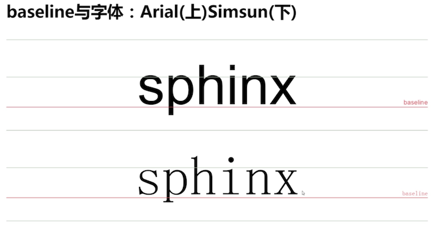
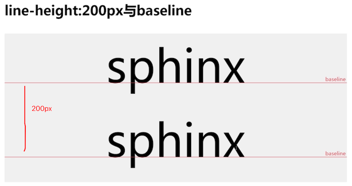
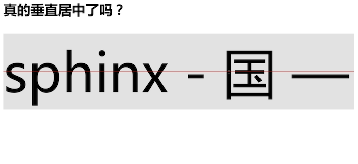
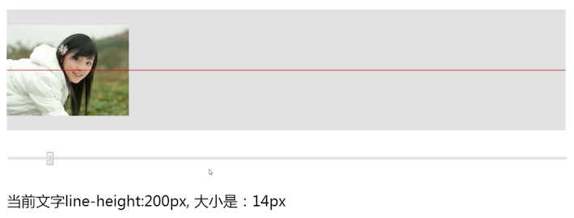
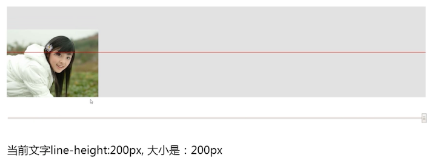
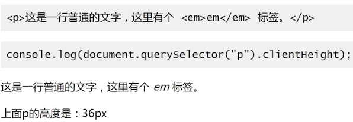
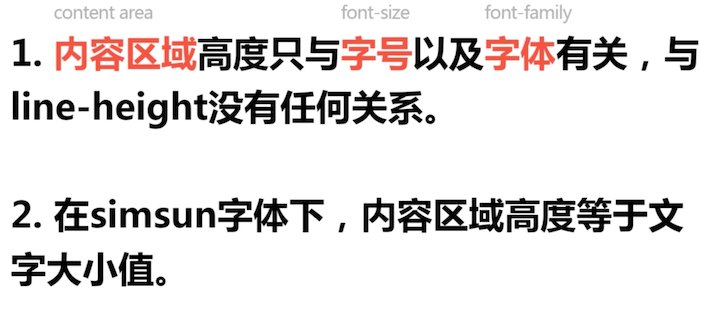
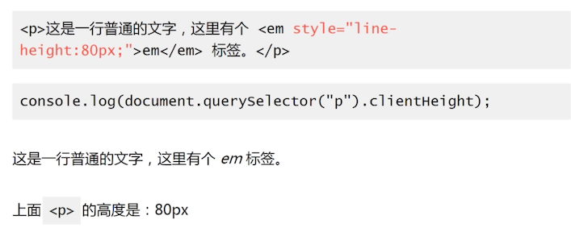

# line-height 行高
简介：本课程将带领大家深入理解 
- line-height 的定义
- line-height 与恒内框盒子模型的关系
- 高度机理
- 各类属性值
- 图片的表现等内容，

同时张鑫旭老师将倾情分享一些实际开发中应用的经验！

[[toc]]

## 1. line-height 的定义

**定义**：两行文字基线之间的距离

1. 什么是基线？ 
2. 为何是基线？ 
3. 需要两行吗？ 

### 什么是基线


如上图，在中学，写英文的本子，为了让我们写英文字母整齐使用的

### 为何是基线

可以是中线？可以是底线？个人觉得是可以的，那么为什么是基线？

**这是因为：** 基线乃 `* 线`（任意线）定义之根本

比如：文本的上边缘线、下边缘线等，都是基于基线来定义的


上图是针对不同的预先体系，它的基线是不一样的

### 需要两行吗？

一行文字也是有行高的！两行的定义已经决定了一行的表现！

本章稍后章节[3. line-height 的高度机制原理](#_3-line-height-的高度机制原理) 详细讲解

### 一些直观的展示图

仔细看这些图，能让你更清楚的明白基线与行高是什么东西


不同字体之间的基线也不太一样，如下图和上图的比较，上图的偏下，下图的偏上



行高与基线的直观展示



### 何为 `line-height` 可以让单行文本垂直居中？



实际上不是不是完全的垂直居中了，下面使用图片来展示



字体为 14 px 的时候，看起来是垂直居中的，但是吧字体大小变得更大



可以发现，没有垂直居中了；而只有字体大小为 0 时，才会真正的垂直居中

问题：为什么会这样表现呢？这就与 「行内框盒子模型」有关了

## 2. line-height 与行内框盒子模型

> 行内框盒子模型- CSS 进阶必备知识

所有内联元素的样式表现都与行内框盒子模型有关！

例如：浮动的图文环绕效果

```html
<p>普通文字，这里有个<em>em</em>标签</p>
```
上面的代码包含了 **4** 种盒子：

1. 内容区域（content area）

    是一种围绕文字看不见的盒子，盒子大小与 `font-size`大小相关

    大神理解：选中文字出现的蓝色背景应该就是这个盒子

    

2. 内联盒子（inline boxes）

    

3. 行框盒子（line boxes）

    每一行就是一个 行框盒子。每个行框盒子又是由一个一个内联盒子组成

    

    无论是否是由于宽度不足导致整个 P 标签换行，只要是两行就是两个行框盒子，

4. 包含盒子（containing box） 

    `<p>` 标签所在的位置，此盒子由一行一行的行框盒子组成

    

汇总下:

1. 内容区域（content area）
2. 内联盒子（inline boxes）
3. 行框盒子（line boxes）
4. 包含盒子（containing box）

由下向上包含，其中 2 和 1 的关系，说不清

疑问：了解行内框盒子模型，对理解 line-height 有什么现实意义？请看下一小节

## 3. line-height 的高度机制原理

> 深入理解内联元素的高度表现

### 文本占据的高度



那么整个高度是从哪里来的呢？它不是由文字撑开得到的，而是由 line-height 决定的，下面进行实践


- test1：虽然他的文字很大，但是它的高度就是中间那一根线，其实是没有高度的，那一根线是边框的高度
- test2：虽然它的文字大小为 0，但是它的高度很高

所以 **内联元素的高度是由 line-height** 决定的！

> **第 1 小节的问题：**line-height 明明是两基线距离，单行文字哪来行高？还控制了高度？

要回答这个问题，我们需要提前知道的知识点有：

1. 行高由于其继承性，影响无处不在，即使单行文本也不例外
2. 行高只是幕后黑手，**高度的表现不是行高**，而是 **内容区域** 和 **行间距**

### 内容区域高度

只不过，正好他们碰巧了




在宋体下：`font-size`+  行间距 = `line-height`，其他字体则可能不是

### 行间距

下面计算，是在宋体的情况下，可以这样计算：

```css
font-size: 240px;
line-height:360px;

则 行间距 = 360px -240px = 120px
```

### 半行间距

行间距上下拆分，就有了「半行间距」 ，`半行间距计算公式 = 行高 - 内容区域高度 / 2`


在微软雅黑字体下，它的半行间距就是 21.5px 。至于那个 317 ，在 Chrome 浏览器开发模式中（F12）可以查看


在宋体的下，它的内容区域高度就是 240px，可以明显的看到它的行半间距明显比微软雅黑要高出不少

### 总结

- 行高决定内联盒子高度
- 行间距墙头草，可大可（甚至负值），保证高度正好等于行高。

行高需要两根基线，但是由于 `内容区域 + 行间距 = 行高`，所以看起来就像行高决定了它的高度

>  **问题 2**：如果有多个不同行高的内联盒子？这时候高度会怎么表现

网上乃至各大教程讲解：由行高最高的那个盒子决定。

这个结论，只对了一半：



上面这个例子，其中有一个匿名内联盒子，和一个 em 的内联盒子，P 的高度刚好久等于行高


而这个例子来看，内联盒子还是行高 80px，但是给了一个往上的偏移，整个 P 的高度就变成 98 px 了。

所以：**由行高最高的那个盒子决定**，是不准确的；（至于 vertical-align 则是内联元素中非常重要的东西，下一节讲解）

多行文本（行多个行框盒子的包含容器）的高度就是 **单行文本高度累加**

> 问题 3：若行框盒子里面混入 inline-block 水平元素（如图片），高度如何表现呢？

该问题下节课讲解

## 4. line-height 各类属性值


## 5. line-height 与图片的表现


## 6. line-height 的实际应用