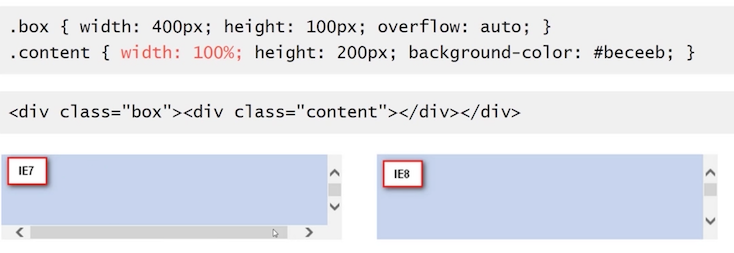
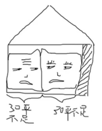
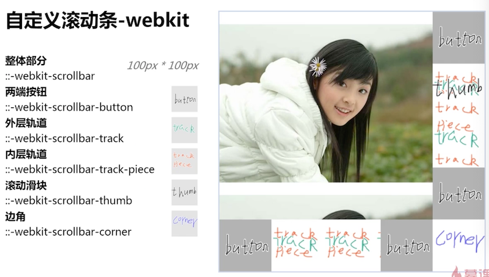
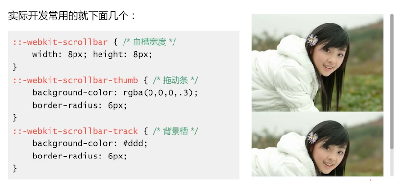

# overflow
简介：overflow 看上去其貌不扬，其中蕴含的知识点还是很多的。
有很多鲜为人知的特性表现，本课程就将带你走入 overflow 的世界，为你打开另外一扇学习之窗。

## 1. overflow 基本属性

> 基本表现，包括兼容性等


1. visible ( 默认 )

   图片超出框框同样显示

2. hidden 

   超出的部分会被 **隐藏**； 不是剪裁

3. scroll 

   在容器右侧和下侧出现滚动条，而且一直不消失

4. auto 

    在容器右侧和下方智能出现滚动条，当内容没有超出区域时，不显示滚动条

5. inherit

   兼容性不好，IE8+ 才支持

### overflow-x/y hidden 特殊说明


上面那个图，图片是超出去的，让 `overflow-x:hidden` 生效，就变成上述那样了，这很奇怪，按属性值来说，应该是让 x 轴隐藏掉，这的确是下方被隐藏了，但是 y 轴出现了滚动条。

这不是 BUG，是特性：当 x、y **一方设置为 visible 时**，另一方出现 hidden 、auto、scroll 时，另一方会被 **重置为 auto**

### 兼容性

#### 各个浏览器表现不一样

在各个浏览器上表现形式都不太一样


Google Chrome 浏览器上支持样式自定义，其他的就不行了，反正就是丑

#### 宽度设定机制



右图是代码对应的描述效果，只有垂直滚动条出现，内容高度 200px 大于容器的 100px。

这是由于宽度设定即使的问题，在宽度 100% 时会计算成外框的宽度，但是垂直滚动条出现时 ，实际的内容区域会被压缩，导致在 IE7 出现了横向滚动条

### 如何让 overflow 起作用

1. 非 `display: inline` 水平
2. 对应方位的尺寸限制 `width/height/max-width/max-height/absolute` 拉伸
3. 对于单元格`td`等，还需要 table 为`table-layout:fixed`状态才行

### `voerflow:visible` 妙用


## 2. overflow 与滚动条

> 滚或不滚，我就在那里

### 滚动条出现的条件

1. 当 `overflow:auto/scroll`  时， `<html>、<textarea>` 自带滚动条
2. 内容尺寸超出了容器的限制


如上图，当内容大于区域时会自动出现滚动条

### `body/html` 与滚动条

::: tip 重要
无论什么浏览器，默认滚动条均来自 html 标签，而不是 body 标签。
:::

**原因：**新建一个空白的 HTML 页面，`<body>` 默认有 `.5em`margin 值，如果滚动条出现在 `<body>` 上，那么滚动条与浏览器边缘则会有间距，而不是靠着浏览器边缘


在不同的浏览器下，它默认值不同

- IE7 浏览器默认： `html {overflow-y: scroll}`
- IE8 浏览器默认： `html {overflow: auto;}`

所以如果我们想要去除页面默认滚动条，只需要

```css
html{ overflow: hidden;}
```

### `body/html` 与滚动条 

如何知道浏览器的滚动条高度，找个需要 JS 支持

* chrome 浏览器是： `document.body.scrollTop`
* 其他浏览器是：`document.documentElement.scrollTop`

目前，两者不会同时存在，因为，坊间流传这类写法：
```javascript
// 因为必然有一个为 0，但是应该很容易出错吧。
// 会出现 undefined 吧？ 用 || 双或 来代替+号更好
var st = document.body.scrollTop + document.documentElement.scrollTop
```

### overflow 的 padding-bottom 缺失现象

```css
.box { width:400px; height:100px; overflow:auto; padding:100px 0 }
/** 重点是后面哪个上下 padding 100px */
```


左侧是 chrome 浏览器，滚动条滚动到最底部，会出现 100 px 的空白，其他浏览器则不会出现

**导致：不一样的 scrollHeight（元素内容高度）**

### 滚动条的宽度机制

一句话：滚动条会占用容器的可用宽度或高度

怎么计算滚动条的宽度呢？通过下面的方法可以简单获得
```html
  <div class="box">
    <div id="in" class="in"></div>
  </div>
```
```css
  .box {
    width: 400px;
    height: 400px;
    overflow: scroll;
    .in {*zoom:1 /* for ie7*/}
  }
```
```javascript
// 结果是17
console.log(400 - document.getElementById('in').clientWidth)
```

结果：`ie7/chrome/fireFox` 宽度应该都是 17，这个宽度是跟着用户主题的不一样而不一样的

### `overflow:auto`的潜在布局隐患

因为有滚动条出现占用宽度，那么在这类布局下，就有可能会出现直接崩溃，布局错乱



如上图，房子本来是 60 平，每人 30 平，当滚动条出现时，就破坏了这种平衡。

在实现此类布局时，要么预先留出滚动条的宽度，要么就采用自适应布局

### 水平居中跳动问题

在页面中的内容，出现滚动条和不出现滚动条，会导致内容往左跳动，这个体验非常的不好。

比如以下的水平居中对齐布局：

```css
.container { width:1150px; margin: 0 auto;}
```
这类布局当滚动条出现的时候，由于滚动条会占用宽度，就会导致内容往右边跳动

那怎么修复呢？有以下两种方法：

1. 让页面一开始就显示垂直滚动条

  ```css
  html { overflow-y:scroll; }
  ```
2. 动态宽度

  ```css
  // ie9 +
  // 100vw：浏览器宽度； 100%：可用内容宽度
  // 自己测试在 html 上。内容貌似也没有怎么跳动了
  .container{padding-left: calc(100vw - 100%);}
  ```

### 自定义滚动条-webkit内核



上图左右标识了对应部分，可以参考他们的位置

- 整体部分 `::-webkit-scrollbar` 
- 两端按钮 `::-webkit-scrollbar-button`
- 外层轨道 `::-webkit-scrollbar-track `
- 内层轨道 `::-webkit-scrollbar-track-piece `
- 滚动滑块 `::-webkit-scrollbar-thumb `
- 边角 `::-webkit-scrollbar-corner `

还有其他伪类元素等，自行学习



如上图的效果，就好看多了；

直接把这个放在 css 中就可以了。但是要有滚动条出现才有效果。

```css
::-webkit-scrollbar { /*血槽宽度*/
  width: 8px; /*控制垂直滚动条宽度*/
  height: 8px; /*控制水平高度 */
}

::-webkit-scrollbar-track { /*背景槽*/
  background-color: #ddd;
  border-radius: 6px;
}

::-webkit-scrollbar-thumb { /*拖动条*/
  background-color: rgba(0, 0, 0, .3);
  border-radius: 6px;
}

```

经过尝试，在我的 mac 上的 Chrome 中改不改感觉都是一样的

且只要定义了 `-webkit-scrollbar`，那么下面都要定义，不然滚动条就会消失，应该是把自定义默认的都给重置为无了吧。

如果嫌弃自定义的滚动条丑，那么可以使用别人写好的插件库来模拟滚动条

### IOS 原生滚动回调效果

如果是运行在 IOS 系统上的化，可以使用如下配置，可以让滚动效果丝滑起来

```css
-webkit-overflow-scrolling: touch
```

## 3. overflow 与 BFC

> 块状格式化上下文，又见浮动亲戚

## 4. overflow 与 absolute 绝对定位

## 5. 依赖 overflow 的样式表现
## 6. overflow 与锚点技术