#  relative 相对定位

简介：relative 和 absolute 的关系总让我们头疼。

张鑫旭大大将在本次课程中给大家生动且深入的剖析二者的关系，以及 relative 与 z-index 层级的关系，
同时给大家分享一些好的 relative 实践准则。小伙伴们还等什么？

[[toc]]

## relative 和 absolute 相煎关系

### 同源性

```css
position: absolute
position: relative
```

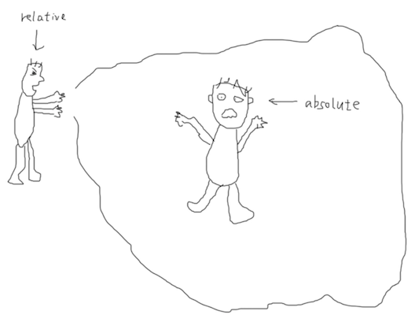

absolute 太厉害了，它哥哥 reative 管束它

### 限制作用

1. 限制 `left/top/right/bottom`定位
2. 限制 `z-index`层级
3. 限制在 `overflow`下的嚣张气焰

#### 限制定位

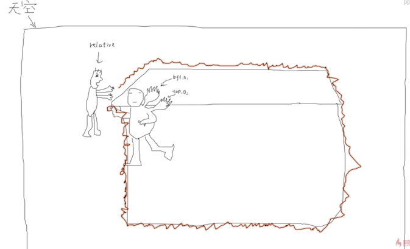

没有 relative 限制的 absolute ，可以飞到天空上去，限制之后，就只能被关在屋子里了

#### 限制层级

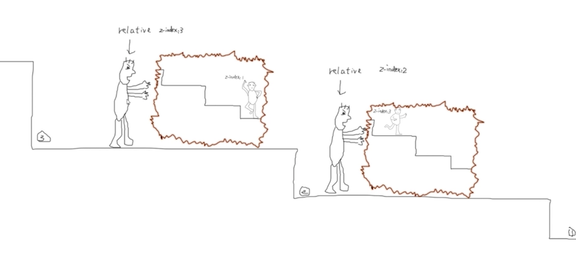

在没有 relative 时，哪个的层级高，就高，当 relative 出现后，就要看 relative 的层级了，他们自己的层级不对外影响了

#### 限制超越  overflow

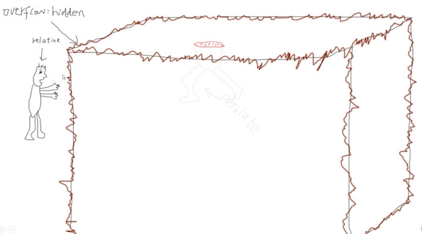

absolute 可以超越 overflow，relative 后，就不能超越了

### relative 与 fixed

- 同源性

  ```css
  position: relative
  position: fixed
  ```

- 限制性

  只能限制 z-index 属性

## relative 与定位

relative 自身的定位有两个特性：

- 相对自身
- 无侵入

### 相对自身

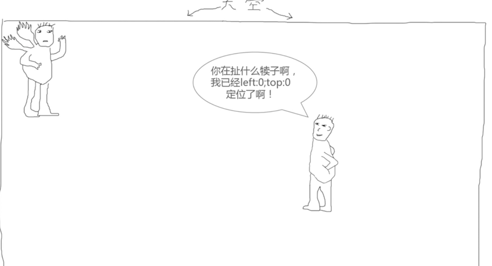

天使是 absolute，右边的是 relative， 都定位，relative 还在原地。。

因为是它相对自身的定位，绝对定位是找限制它的边界定位的。

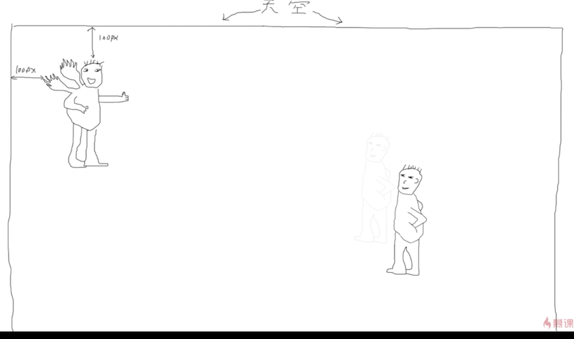

`left 100 px,right 100px` 就看到 relative 在自身的基础上飘了一点

### 无侵入

一个网页中 6 个格子，排列得很整齐

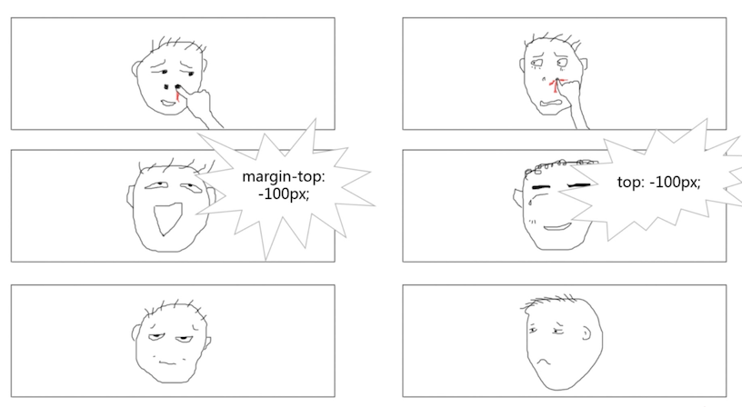

当他们各自执行自己的任务后，就发生了不同的变化；右侧是 relative 的。

对于他们自身的表现都是相同的，都是网上偏移 100px，重点是跟随他们的元素

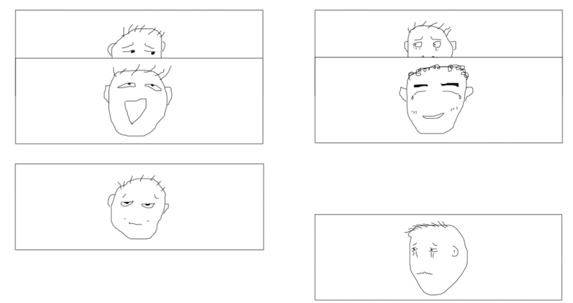

relative 后面的元素没有发生任何的变化。这就是它的特性

### 无侵入定位的用作：自定义拖拽

浏览器其实有他们自己的拖拽 API，缺点是不能自定义一些东西，比如手型

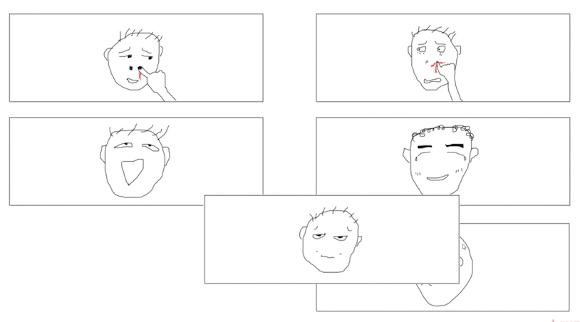

可以利用 relative 来实现之定义拖拽，如上图，将 左侧的拖动超过右侧一半的时候，操作 下面的元素移动到左边来，放下后，再完整的将拖动的 dom 交换

### 对立属性同时存在有什么表现？

当 `top/bottom` 和 `left/right` 对立属性同时存在时的表现是？

- 绝对定位是拉伸
- 相对定位是斗争

`top/bottom` 同时存在，只有 top 生效

`left/right` 同时存在，只有 left 生效

## relative 与 z-index 层级的关系

### 提高层叠上下文

这里不深入讲解，后续再 z-index 章节讲解；

可以想象成是提高它的层级，而且是鬼畜级别（相当厉害）

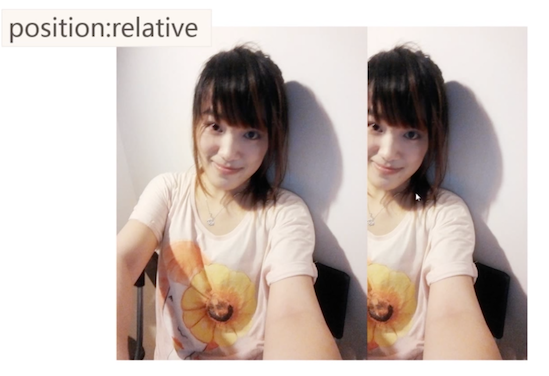

当两张图片重叠实，没有其他样式的时候，是后来居上的，直接施加 relative，则直接反超了

### 新建层叠上下文与层级控制

前面说到，两个绝对定位元素的层级大小，被 relative 后，层级是看 relative 这个父级元素的层级，这个前提是：z-index 是一个数值，因为会产生一个新的层叠上下文

relative 的默认层级是 auto，可以看到，原来绝对定位元素的层级为 3 ，和左边的层级一样了，在官网文档里面的描述事件，当 relative 层级为 auto 时，是不会新建层叠上下文的

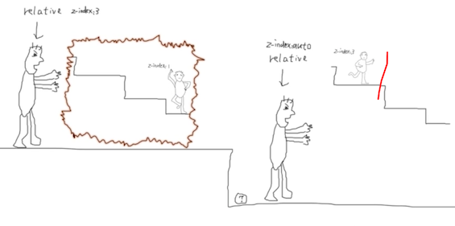

**结论**：没有限制内部 absolute 元素层叠的问题（不包括 IE6 和 IE 7）

## relative 的最小化影响准则

本章是讲心得干货，最佳实践

**所谓 relative 的最小化影响准则：**指的是，尽量降低 relative 属性对其他元素或布局的潜在影响

有两点：

1. 尽量避免使用 relative
2. 非要使用的化，让它最小化

### 尽量避免使用 relative

absolute 不依赖 relative，这个在绝对定位中讲过了。

### relative 最小化原则

将猪头定位到右上角，如果非要用 relative 的话：

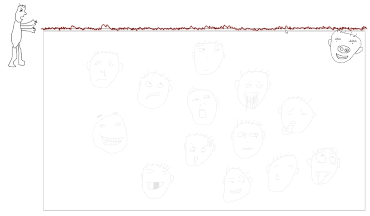

这一张是作用在整个大容器上，范围过大； 上图是最小化原则的代码；如果是应用下面的代码，那么表现就应该是整个框框都被圈起来的

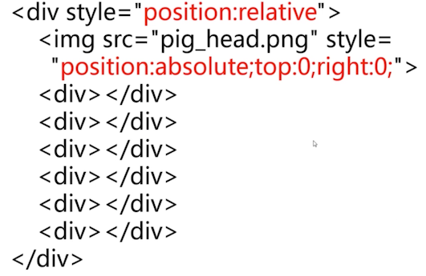

将它提出来，只针对这一个猪头进行 relative 定位，最小化原则

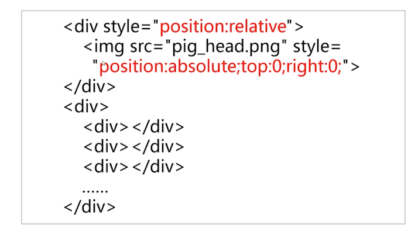

这个代码它不会占据任何空间，不会有任何的问题。不会影响其它的，比如出现各种重叠问题