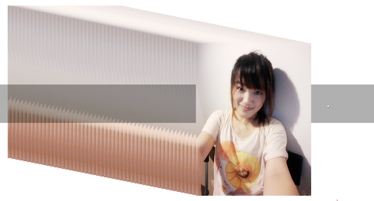
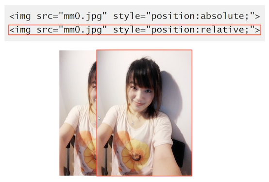
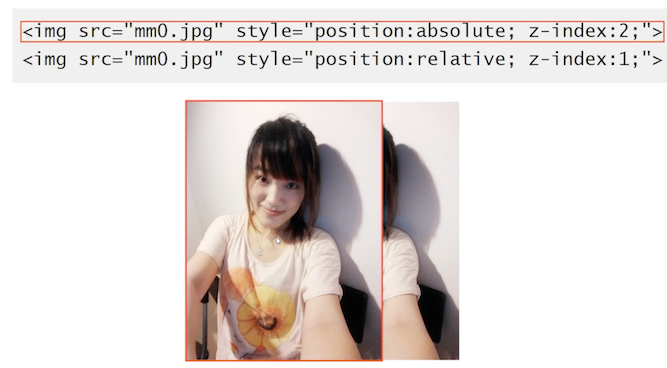
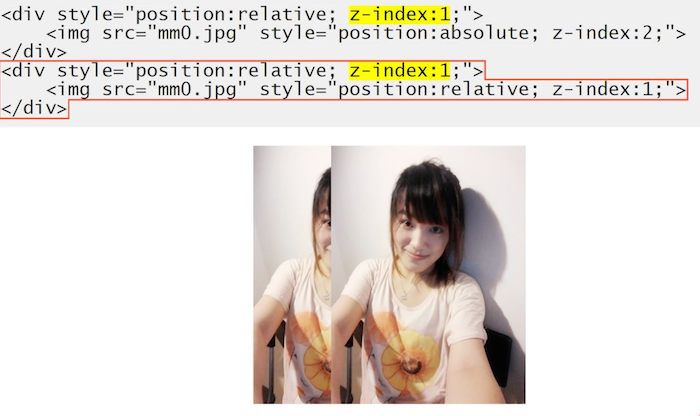
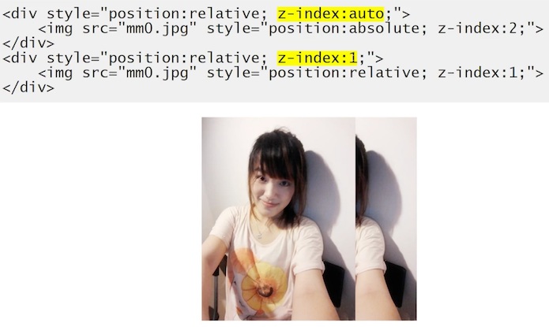

# z-index 层级
简介：本课程中，张鑫旭大大将带领大家学习 z-index 的基本知识，并深入讲解嵌套表现以及 z-index 计算规则。
同时还将介绍 CSS 中非常基础且重要的元素层叠表现的概念、元素的层叠顺序，以及 z-index、
还有其他 CSS 属性与层叠上下文的关系。还有最值得期待的 z-index 实践经验分享！

[[toc]]

## 1. CSS z-index 基础

> 了解 z-index 的语法，支持的特性等

### 含义
z-index 属性指定了元素及其子元素的 「z 顺序」，而 「z 顺序」可以决定当元素发生覆盖的时候，哪个元素在上面。通常一个较大 z-index 值的元素会覆盖较低的那一个

### 支持的属性值

1. `z-index: auto`： 默认值
2. `z-index: <integer>` ：数值
3. `z-index:  inherit`： 继承

### 基本特性

1. 支持负值： `z-index:-1` ，整个后续会讲解比较微妙

2. 支持 css3 animation 动画

3. 在 css2.1 时代，需要和定位元素配合使用

   如果不考虑 css3，只有定位元素（`position：relative/absolute/fixed/sticky`）的 z-index 才有作用，在 css3 中有例外

下图是一个从 `z-index -1 到 50 ` 的动画，图片也是从 -1 到 50 排列得，当动画播放的时候，就会产生类似进度条的样式，你会看到，透明的区域是一层一层显示出来的



动画代码如下

```css
@keyframes zIndex {
  0% { z-index: -1; }
  100% {z-index: 51;}
}
```

但是这种动画，并没有什么太多的适用场景

## 2. z-index 与 CSS 定位属性

> 理解嵌套表现以及 z-index 计算规则

**一个观点要知道：**z-index 只对定位元素有作用


### 如果定位元素 z-index 没有发生嵌套

1. 后来居上的准则
2. 哪个大，哪个上

#### 后来居上



#### 哪个大哪个上



### 如果定位元素 z-index 发生嵌套

祖先优先原则，前提是：非 auto



很好理解，看最祖先的层级来算。如果为 auto，则第一个覆盖了第二个



为什么会这样呢？

在官网文档有对应的描述：**CSS2.1:z-index:auto**，
当前层叠上下文的生成盒子层叠水平是 0， 盒子（除非是根元素）不会创建一个新的层叠上下文

## 3. CSS 中的层叠上下文和层叠水平

> 元素层叠表现基础且 **非常重要的概念**

###  **层叠上下文（stacking context）**
是 HTML 元素中的一个三维概念，表示元素在 z 轴上有了「可以高人一等」


就是我们人眼看演示器，层叠上下文可以让这个元素在 z 轴上离我们更近。


上图，使用打比方的形式，让你能记住；

**层叠上下文（stacking context）** 是表示普通老百姓 HTML 元素当官了，离皇帝更近了。

### 具有层叠上下文的元素有

* 页面根元素天生具有层叠上下问，称之为「根层叠上下文」   -- 皇亲国戚
* z-index值为数值的定位元素也具有层叠上下文   -- 科考入选
* 其他属性   -- 其他当官途径

### 层叠水平（stacking level）

**层叠上下文中** 的每个元素都有一个 **层叠水平**，决定了同一个层叠上下文中元素在 z 轴上的显示顺序。

也是遵循「后来居上」和「谁大谁上」的层叠准则，该准则在层叠元素领域中是通用的。

用当官的来解释：所谓打狗看主人，每一个当官的家里儿孙、仆人什么的，都有一个论资排辈（即层叠水平），决定了在一起的时候，谁排在前面，离官员更近

::: tip 注意
层叠水平（stacking level）和 z-index 不是一个东西。普通元素也有层叠水平，而 z-index 只在定位元素上才有作用
:::

### 层叠上下文的特性

* 层叠上下文可以嵌套，组合成一个分层次的层叠上下文

  解释：一个家，爸爸可以当官，孩子也可以同时当官的。这家族的官就当得比较有层次

* 每个层叠上下文和兄弟元素独立：

  当进行层叠变化或渲染的时候，只需要考虑后代元素。

  解释：自己当官，兄弟不沾光。有什么福利或则变故只有会影响自己的孩子们

* 每个层叠上下文是自成体系的：

  当元素的内容被层叠后，整个元素被认为是在父层的层叠顺序中。

  解释：每个当官的都有属于自己的小团体。当子孙或属下发生的排辈摩擦什么的，都是自己宅院的事情，不会影响官员自己和皇帝之间的距离。


## 4. 元素的层叠顺序


## 5. z-index 与层叠上下文


## 6. 其他 CSS 属性与层叠上下文


## 7. z-index 与其他 CSS 属性层叠上下文


## 8. z-index 相关实践分享