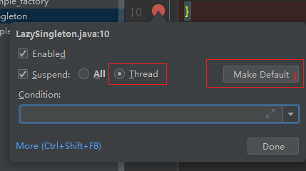
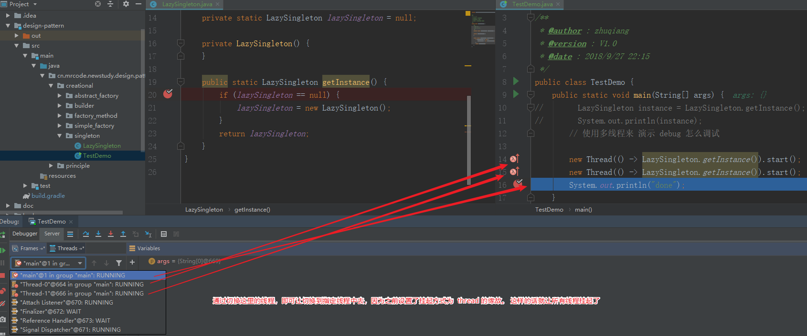
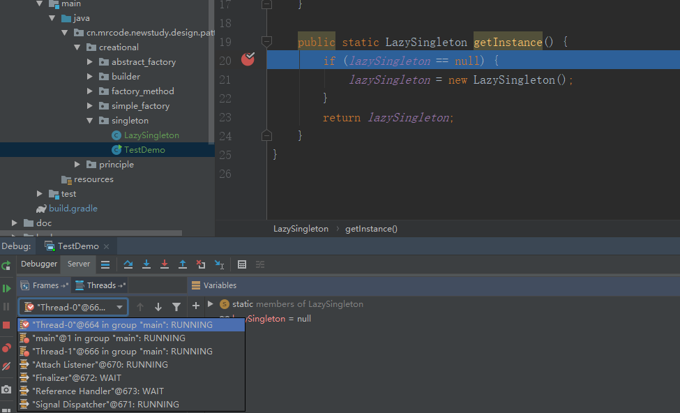
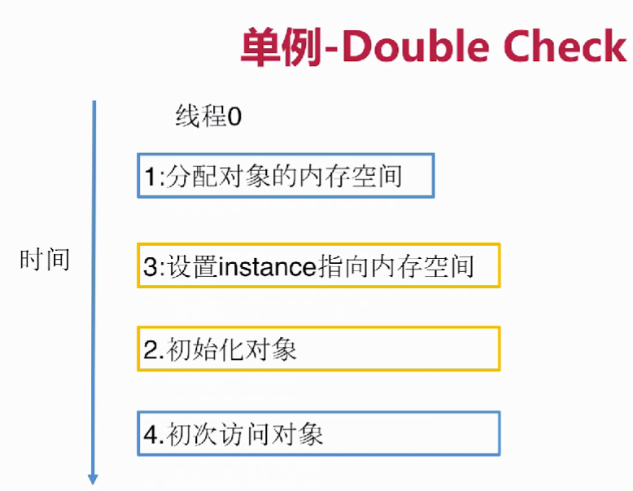
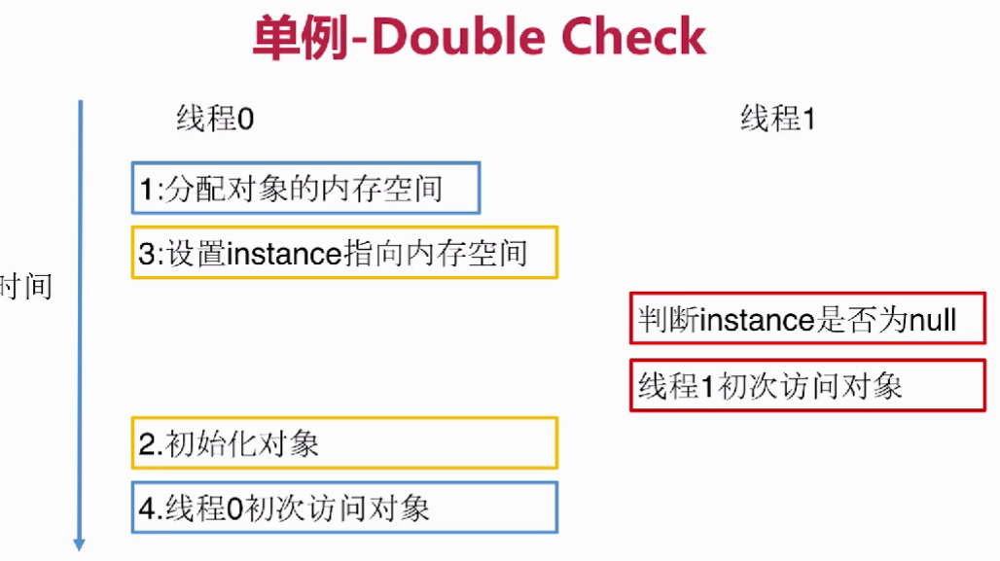
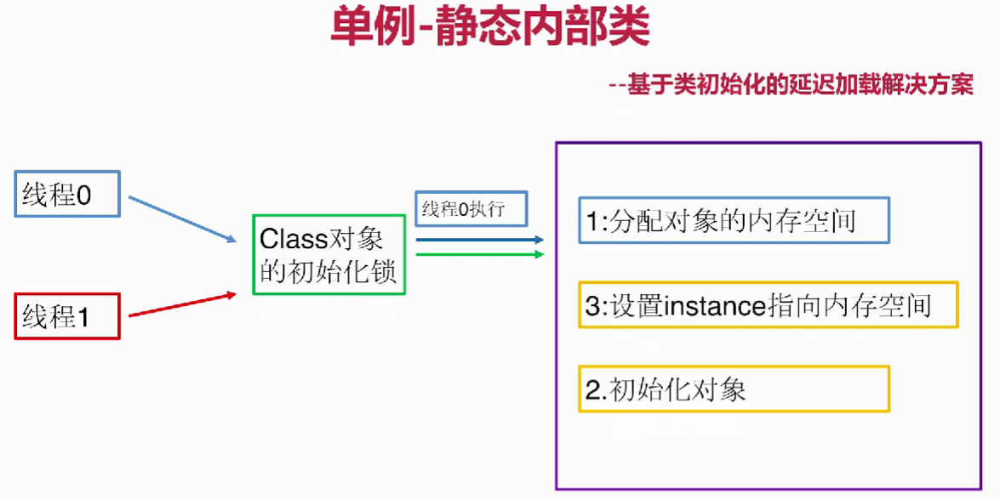

# 单例模式
**定义**：保证一个类仅有一个实例，并提供一个全局访问点

**类型**：创建型

## 适用场景

想确保任何情况下都绝对只有一个实例

## 优缺点

**优点**：

* 在内存里只有一个实例，减少了内存开销
* 可以避免对资源的多重占用
* 设置全局访问点，严格控制访问

**缺点**：

* 没有接口，扩展困难

## 重点

* 私有构造器：防止在外部创建对象
* 线程安全
* 延迟加载：使用的时候才创建
* 序列化和反序列化安全
* 反射：防止反射攻击？

## 实用技能

* 反编译
* 内存原理
* 多线程 Debug

## 相关的设计模式

* 单例模式和工厂模式
* 单例模式和享元模式

## coding

## 懒汉式单例模式

线程不安全的懒汉式单例模式比较简单，两个要点：

1. 私有构造
2. 内部持有一个实例，在访问的时候再初始化

```java
cn.mrcode.newstudy.design.pattern.creational.singleton.LazySingleton
public class LazySingleton {

    private static LazySingleton lazySingleton = null;

    private LazySingleton() {
    }

    public static LazySingleton getInstance() {
        if (lazySingleton == null) {
            lazySingleton = new LazySingleton();
        }
        return lazySingleton;
    }
}
```

```java
public class TestDemo {
    public static void main(String[] args) {
//        LazySingleton instance = LazySingleton.getInstance();
//        System.out.println(instance);
        // 使用多线程来 演示 debug 怎么调试

        new Thread(() -> LazySingleton.getInstance()).start();
        new Thread(() -> LazySingleton.getInstance()).start();
        System.out.println("done");
    }
}
```

## 多线程 debug 教程


先打上断点，然后在断点上右键，即可出现上图中的内容；选择 thread 方式，并设置为默认



看上图，因为现在在 main 线程中，使用 debug 停留了。

切换到 线程0 中，可以看到一直阻塞在这里的。这样一来多线程调试就更方便了




## 懒汉式 - synchronized

保证线程安全最简单的就是加 synchronized 关键字；

```java
public synchronized static LazySingleton getInstance() {
    if (lazySingleton == null) {
        lazySingleton = new LazySingleton();
    }
    return lazySingleton;
}
```

但是这样会有一个问题，就是每个线程获取都会被阻塞。如果在一个很繁忙的系统中，这里的性能就大大降低了。

可以使用双重检查来优化这个地方，实际上就是减少锁的粒度

```java
public class LazyDoubleCheckSingleton {
    private static LazyDoubleCheckSingleton lazyDoubleCheckSingleton = null;

    private LazyDoubleCheckSingleton() {
    }

    public static LazyDoubleCheckSingleton getInstance() {
        // 第一层不加锁，有值则返回
        if (lazyDoubleCheckSingleton == null) {
            // 假设有2个线程进入到这里在等待了
            synchronized (LazyDoubleCheckSingleton.class) {
                // 那么当第一个线程创建之后，其实是有值的了
                // 所以这里还需要判定一下，有值则不创建了
                // 所以这里是双重判定
                if (lazyDoubleCheckSingleton == null) {
                    lazyDoubleCheckSingleton = new LazyDoubleCheckSingleton();
                    // 这里有一个内存可见性的问题
                    // 上面这一句话其实分为三步
                    // 1. 分配内存给这个对象
                    // 2. 初始化对象
                    // 3. 设置 lazyDoubleCheckSingleton 指向刚分配的内存
                }
            }
        }
        return lazyDoubleCheckSingleton;
    }
}
```

对于这个内存可见性的问题。步骤 2 和步骤 3 可能被重排序。在多线程情况下，如果被重排序了

那么在第一层判断的时候就会判断有值，但是实际上对象还未被初始化。

？：我怎么记忆中是这里初始化了，因为内存可见性，其他线程会认为看不到已经改变

也就是下图中描述的情况；





要解决这个问题：
1. volatile 变量：

  对于一个 volatile 域的写，happens-before 于任意后续对这个 volatile 的读
  但是，不保证写是原子的；
  所以：这里使用 volatile 只是保证一个线程的写对另一个线程可见，加上 synchronized 保证写操作是原子的。在 synchronized 域中可重排序。但是在释放锁的时候，保证结果正确

2. 禁止重排序：使用内部类，让 jvm 来保证两个操作直接的禁止重排

保证 lazyDoubleCheckSingleton 的可见性；给该变量加上 volatile 关键字即可；

volatile ：会让其他 cpu 中缓存的数据失效，读取主存中的数据。即可保证内存对其他线程课件

## 懒汉式 - 内部类

```java
public class StaticInnerClassSingleton {
    private static class InnerClass {
        private static StaticInnerClassSingleton instance = new StaticInnerClassSingleton();
    }

    public static StaticInnerClassSingleton getInstance() {
        return InnerClass.instance;
    }
}
```

静态内部类很简单。下面代码来测试是否是延迟的情况

```java
public class StaticInnerClassSingleton {
    {
        System.out.println("单例类初始化");
    }

    private static class InnerClass {
        static {
            System.out.println("内部类初始化");
        }

        private static StaticInnerClassSingleton instance = new StaticInnerClassSingleton();
    }

    public static void print() {
        System.out.println("测试是否是延迟初始化的");
    }

    public static StaticInnerClassSingleton getInstance() {
        return InnerClass.instance;
    }
}
```

执行测试代码
```java
  StaticInnerClassSingleton instance = StaticInnerClassSingleton.getInstance();

  输出：

  内部类初始化
  单例类初始化
```

执行测试代码

```java
StaticInnerClassSingleton.print();

输出

测试是否是延迟初始化的
```

可以看到，只有在使用该实例的时候，才会被初始化，而这个初始化时 jvm 保证线程安全性的；

原理是：



在类初始化的时候 jvm 会获取一个初始化锁，保证多个线程对同一个对象的初始化安全问题

这里有一个遗留问题：上面的代码中。没有对单例类私有构造。一定要加深认识


## 饿汉式

```java
public class HungrySingleton {
    private final static HungrySingleton hungrySingleton = new HungrySingleton();

    private HungrySingleton() {
    }

    public static HungrySingleton getInstance() {
        return hungrySingleton;
    }
}
```

在类加载的时候完成赋值；

在之前差不多把单例模式修补得比较完善了，现在来破坏单例模式。

## 破坏单例模式

使用序列化，再反序列化，那么这个对象还是之前的那个对象吗？

```java
@Test
public void test() throws IOException, ClassNotFoundException {
    HungrySingleton instance = HungrySingleton.getInstance();


    // 序列化到文件
    ObjectOutputStream oos = new ObjectOutputStream(new FileOutputStream("HungrySingleton"));
    oos.writeObject(instance);

    // 从文件读取出来

    ObjectInputStream ois = new ObjectInputStream(new FileInputStream("HungrySingleton"));
    HungrySingleton instanceFromFile = (HungrySingleton) ois.readObject();

    System.out.println(instance);
    System.out.println(instanceFromFile);
    System.out.println(instance == instanceFromFile);
}
```

输出

```java
cn.mrcode.newstudy.design.pattern.creational.singleton.HungrySingleton@7494e528
cn.mrcode.newstudy.design.pattern.creational.singleton.HungrySingleton@7d0587f1
false
```

那么怎么破解这个问题呢？很简单在单例类中增加一个方法

```java
private Object readResolve() {
    return hungrySingleton;
}
```

原理是什么呢？这个要看源码

```java
java.io.ObjectInputStream#readObject
java.io.ObjectInputStream#readObject0

case TC_OBJECT:
    return checkResolve(readOrdinaryObject(unshared));

找到这一行。继续跟踪

private Object readOrdinaryObject(boolean unshared)
      throws IOException
  {
      if (bin.readByte() != TC_OBJECT) {
          throw new InternalError();
      }

      ObjectStreamClass desc = readClassDesc(false);
      desc.checkDeserialize();

      Class<?> cl = desc.forClass();
      if (cl == String.class || cl == Class.class
              || cl == ObjectStreamClass.class) {
          throw new InvalidClassException("invalid class descriptor");
      }

      Object obj;
      try {
          // 首先先通过反射创建实例
          // 当实现了 serializable/externalizable 接口的时候，则返回 true
          obj = desc.isInstantiable() ? desc.newInstance() : null;
      } catch (Exception ex) {
          throw (IOException) new InvalidClassException(
              desc.forClass().getName(),
              "unable to create instance").initCause(ex);
      }

      passHandle = handles.assign(unshared ? unsharedMarker : obj);
      ClassNotFoundException resolveEx = desc.getResolveException();
      if (resolveEx != null) {
          handles.markException(passHandle, resolveEx);
      }

      if (desc.isExternalizable()) {
          readExternalData((Externalizable) obj, desc);
      } else {
          readSerialData(obj, desc);
      }

      handles.finish(passHandle);

      // 这里再判定 是否有读解析方法
      if (obj != null &&
          handles.lookupException(passHandle) == null &&
          desc.hasReadResolveMethod())
      {
          Object rep = desc.invokeReadResolve(obj);
          if (unshared && rep.getClass().isArray()) {
              rep = cloneArray(rep);
          }
          if (rep != obj) {
              handles.setObject(passHandle, obj = rep);
          }
      }

      return obj;
  }

  // 这里判定这个方法是否存在
  // 也就是说，如果你中的类中定义了 readResolve 方法，那么将会调用该方法
  // 也就是不允许外部实例化
  // 这里一定要看注释，英文的也要认证翻译看。不然光看这个代码，是看不出来什么的
  boolean hasReadResolveMethod() {
      return (readResolveMethod != null);
  }
  /** class-defined readResolve method, or null if none */
  private Method readResolveMethod;

  // 可以搜索下这个变量在哪里赋值的,这里就可以看到了，定义了这么一个字符串，去查找这个方法
  readResolveMethod = getInheritableMethod(
                        cl, "readResolve", null, Object.class);
```
