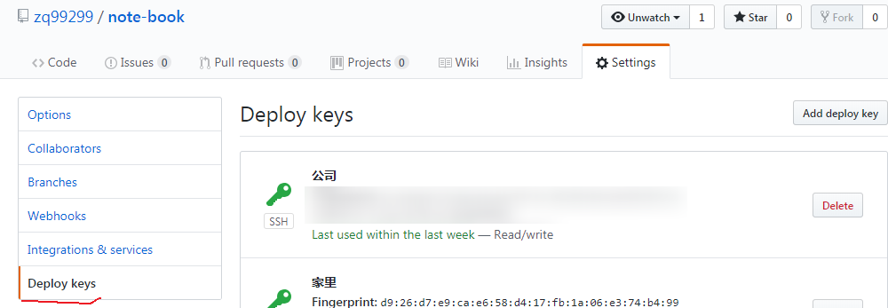

# vuepress 构建自己的项目笔记

偶然发现一个 Markdown 文档生成的利器，也是 vue 官网推荐的一个工具 [vue-press](https://vuepress.vuejs.org/zh/guide/)

## 初体验

官网的 [快速上手](https://vuepress.vuejs.org/zh/guide/getting-started.html#%E5%85%A8%E5%B1%80%E5%AE%89%E8%A3%85)
能教你怎么快速的看到一个主页面。这里总结下步骤

1. 创建一个项目

    ```
    创建目录：vuepress-demo
    并用 npm init 命令初始化一个 packagen.json 文件出来。初始值如下

      {
        "name": "vuepress-demo",
        "version": "1.0.0",
        "description": "vuepress 使用测试",
        "main": "index.js",
        "scripts": {
          "test": "echo \"Error: no test specified\" && exit 1"
        },
        "author": "",
        "license": "ISC"
    }
    ```
   其实这里都不是罪重要的。最重要的是添加 依赖和设置入口

2. 添加依赖和设置入口

    ```json
    {
      "name": "vuepress-demo",
      "version": "1.0.0",
      "description": "vuepress 使用测试",
      "scripts": {
        "docs:dev": "vuepress dev docs",
        "docs:build": "vuepress build docs"
      },
      "devDependencies": {
        "vuepress": "^0.14.2"
      }
    }

    ```
    并使用 `npm install` 命令安装 vuepress 依赖

3. 首页编写

    随意写一点内容即可
    ```
    目录结构如下：
    | - docs
     |- README.md
    ```
5. 运行 `npm run docs:dev ` 默认

   有一个功能就是，这个会监控到你的修改，然后会自动编译，
   也就是说我们只要配置好了后，就可以用 atom 来编写文档，也能实时查看浏览器中的变化。简直是神器

## 简单配置

这些看官网文档即可，讲得很详细了。这里我想说一点就是侧边栏和显示的规则是什么。还有就是几点注意事项

1. 首先只要是 docs 目录下的所有 md 文档都会被解析成 html ，这个可以在浏览器中直接输入地址查看效果
2. 侧边栏的显示是需要在 config.js 中配置的。
3. 侧边栏中配置的一个 title 相当于是一个根的侧边栏展示。

   如下面配置了两个 title ，访问 http://localhost:8080/vue-press/ 的时候
   侧边栏展示的只是该配置 children 中的所有抓取到的标题。

4. 主页文件中怎么使用图片？

   `docs/.vuepress/public` 把图片放在这个目录下，则可以直接使用 /xx.png 访问到
5. md 文件中引用图片注意事项

   1. 可以把图片放在 public 全局目录下
   2. 也可以把图片放在与 md 相同目录下，但是引用图片就的使用相对路径了，如 `./xxx,png`

比如下面的侧边栏配置

主要配置是 docs/.vuepress/config.js 文件

```
module.exports = {
    title: 'Hello VuePress',
    description: 'Just playing around',
    sidebar: 'auto',
    themeConfig: {
        docsDir: 'docs',
        nav: [ // 配置顶部导航栏的条目
            {text: 'Home', link: '/'},
            {text: 'vue-press', link: '/vue-press/'},
            {text: 'demeter', link: '/03_design_principles/demeter.md'},
            {text: 'External', link: 'https://google.com'},
        ],
        sidebar: {
            // 配置侧边栏
            '/vue-press/': genSidebarVuePress(),
            '/03_design_principles/':
                genSidebarConfig("设计模式")
        }
    }
}

function genSidebarVuePress() {
    return [
        {
            title: 'vue-press',
            collapsable: false,
            children: [
                ''
            ]
        }
    ]
}

function genSidebarConfig(title) {
    return [
        {
            title,
            collapsable: true,
            children: [
                '',
                // 注意这里，可以写md后缀，也可以不写，也能获取到
                'composition_aggeregation',
                'demeter',
                'dependency_inversion.md',
                'interface_segregation.md',
                'liskov_substitution.md',
                'open_close.md',
                'single_responsibility.md',
                '本章导航.md'
            ]
        }
    ]
}

/*
这个语法就需要自己吧所有路径拼写完整；上面的语法则不需要相当于有一个基础的路径
[
    {
        title: '设计原则',
        collapsable: false,
        children: [
            '',
            // 这里的文档全路径其实就是 docs/03_design_principles
            '/03_design_principles/composition_aggeregation.md',
            '/03_design_principles/demeter',
            '/03_design_principles/dependency_inversion.md',
            '/03_design_principles/interface_segregation.md',
            '/03_design_principles/liskov_substitution.md',
            '/03_design_principles/open_close.md',
            '/03_design_principles/single_responsibility.md',
            '/03_design_principles/本章导航.md'
        ]
    }
]*/

```

### 其他配置参考官网即可
[vuepress](https://vuepress.vuejs.org/zh/guide/) 的文档也是使用 vuepress 编写的，

所以最好的学习方式就是 查看他的源码，文档很少，但是配置中也有 怎么只用 vue 组件的。很完善了

> https://github.com/vuejs/vuepress/tree/master/docs

## 在 md 中使用 vue

> https://vuepress.vuejs.org/zh/guide/using-vue.html

官网中有详细的介绍，这里简单说明下：

添加依赖
```
 "vuepress-theme-vue": "~1.1.0"
```
docs/.vuepress/components 目录下编写 vue 模板。

```
如有一个 Demo-01.vue 的模板
那么 在 md 文件中可以直接写 <Demo-01>
```

注意：使用了 vue 的话，会在左上角生成一个广告位

## 部署到 gh-page

> 官网文档： https://vuepress.vuejs.org/zh/guide/deploy.html#github-pages

这里只说粘贴下我这个项目的 deploy.sh 内容
```bash
#!/usr/bin/env sh

# 确保脚本抛出遇到的错误
set -e

# 生成静态文件
npm run docs:build

# 进入生成的文件夹
cd docs/.vuepress/dist

# 如果是发布到自定义域名
# echo 'www.example.com' > CNAME

git init
git add -A
git commit -m 'deploy'

# 如果发布到 https://<USERNAME>.github.io
# git push -f git@github.com:<USERNAME>/<USERNAME>.github.io.git master

# 如果发布到 https://<USERNAME>.github.io/<REPO>
git push -f git@github.com:zq99299/note-book.git master:gh-pages

cd -
```
(windown 下)在 webstom 或则 gitBase 里面 可以直接运行 deploy.sh 文件。
最好在 gitBase 里面运行，能显示错误信息。

还有一点需要注意的是，使用脚本必须在 gitHub 中添加你本机的 `id_rsa.pub`（里面的字符串） 公钥。

如下图所示：添加之后执行脚本才能推送到分支上去


## 可以作为基础项目的分支
这个分支可以直接克隆下来 ，稍微修改，就能使用起来了。快速建立新的笔记项目

建议认真看一遍官网文档，vuepress 不仅可以单独用来生成 markdown 的文档站点，还能在已有的 vue 项目中使用，

换句话说，一个后端系统的系统说明和帮助就可以使用 vuepress 来构建，这个主意是很不错的。

* 构建站点好看
* 默认主题配置方便
* 使用 atom 来编写，图片插件来弥补 markdown 中插入图片不方便的缺陷

所以这个简直就是完美

> 分支地址如下：
