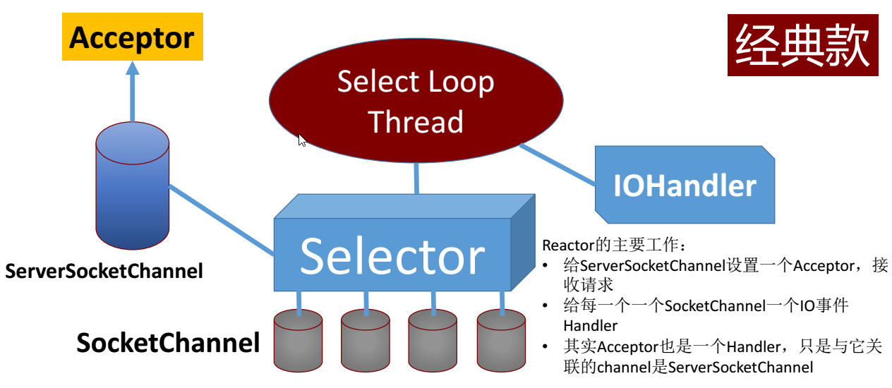

# 前端连接探索

## 基础知识
Reactor 模型



Acceptor 处理前端连接的入口类， 来分析 Acceptor 的源码  
## 初始化
io.mycat.MycatServer#startup 是 mycat 启动类，里面对 Acceptor 做了初始化操作。
```java


else {
     LOGGER.info("using nio network handler ");

     NIOReactorPool reactorPool = new NIOReactorPool(
         DirectByteBufferPool.LOCAL_BUF_THREAD_PREX + "NIOREACTOR",
         processors.length);
     connector = new NIOConnector(DirectByteBufferPool.LOCAL_BUF_THREAD_PREX + "NIOConnector", reactorPool);
     ((NIOConnector) connector).start();

     manager = new NIOAcceptor(DirectByteBufferPool.LOCAL_BUF_THREAD_PREX + NAME
         + "Manager", system.getBindIp(), system.getManagerPort(), mf, reactorPool);

     // 构建前端连接处理器
     server = new NIOAcceptor(DirectByteBufferPool.LOCAL_BUF_THREAD_PREX + NAME
         + "Server", system.getBindIp(), system.getServerPort(), sf, reactorPool);
   }

   manager.start();
   LOGGER.info(manager.getName() + " is started and listening on " + manager.getPort());

   // 处理器开始工作
   server.start();
   LOGGER.info(server.getName() + " is started and listening on " + server.getPort());

   LOGGER.info("===============================================");
```

构造

```java
public final class NIOAcceptor extends Thread implements SocketAcceptor{
	private static final Logger LOGGER = LoggerFactory.getLogger(NIOAcceptor.class);
	private static final AcceptIdGenerator ID_GENERATOR = new AcceptIdGenerator();

	private final int port;
	private volatile Selector selector;
	private final ServerSocketChannel serverChannel;
	private final FrontendConnectionFactory factory;
	private long acceptCount;
	private final NIOReactorPool reactorPool;

	public NIOAcceptor(String name, String bindIp,int port,
			FrontendConnectionFactory factory, NIOReactorPool reactorPool)
			throws IOException {
		super.setName(name);
    // 经典的构造方式
		this.port = port;
		this.selector = Selector.open();
		this.serverChannel = ServerSocketChannel.open();
    // 同步处理
		this.serverChannel.configureBlocking(false);
		/** 设置TCP属性 */
    //  如果端口忙，但TCP状态位于 TIME_WAIT ，可以重用 端口。
		serverChannel.setOption(StandardSocketOptions.SO_REUSEADDR, true);
    //   在默认情况下，输入流的接收缓冲区是8096个字节（8K）
		serverChannel.setOption(StandardSocketOptions.SO_RCVBUF, 1024 * 16 * 2);
		// backlog=100 当前 socket 连接上可以挂起的连接数量，也就是说
		serverChannel.bind(new InetSocketAddress(bindIp, port), 100);
		this.serverChannel.register(selector, SelectionKey.OP_ACCEPT);
		this.factory = factory;
		this.reactorPool = reactorPool;
	}
```

当有连接 mycat 的请求的时候，会执行

```java
private void accept() {
  SocketChannel channel = null;
  try {
    channel = serverChannel.accept();
    channel.configureBlocking(false);
    // 构造了一个前端连接对象
    FrontendConnection c = factory.make(channel);
    c.setAccepted(true);
    c.setId(ID_GENERATOR.getId());
    // 并且绑定了一个 处理器
    NIOProcessor processor = (NIOProcessor) MycatServer.getInstance()
        .nextProcessor();
    c.setProcessor(processor);

    // 处理读写事件的对象
    NIOReactor reactor = reactorPool.getNextReactor();
    reactor.postRegister(c);

  } catch (Exception e) {
        LOGGER.warn(getName(), e);
    closeChannel(channel);
  }
}
```

目前的代码完成了连接的注册，现在的类图如下


- NIOAcceptor ：前端连接处理
- NIOReactor ：处理读写事件，后续的客户端与 mycat 交互处理类
- FrontendConnection ：前端连接对象，可以想象成是一个数据库连接
- NIOProcessor ：该对象还需要后面源码分析才能明白作用是什么

## 构造 FrontendConnection 时做了什么

> socket 相关属性解说：http://elf8848.iteye.com/blog/1739598

`FrontendConnection c = factory.make(channel);`

是通过工厂构造的

```java
public abstract class FrontendConnectionFactory {
	protected abstract FrontendConnection getConnection(NetworkChannel channel)
			throws IOException;

	public FrontendConnection make(NetworkChannel channel) throws IOException {
    // 设置 socket 通道的属性，端口忙的时候可复用
		channel.setOption(StandardSocketOptions.SO_REUSEADDR, true);
		channel.setOption(StandardSocketOptions.SO_KEEPALIVE, true);

		FrontendConnection c = getConnection(channel);
    // 根据 mycat 的配置，这里就有点不理解了
    // 上面获取连接中已经设置过一次了，这里怎么还设置了一次？
		MycatServer.getInstance().getConfig().setSocketParams(c, true);
		return c;
	}
}
```

```java
public class ServerConnectionFactory extends FrontendConnectionFactory {

    @Override
    protected FrontendConnection getConnection(NetworkChannel channel) throws IOException {
        SystemConfig sys = MycatServer.getInstance().getConfig().getSystem();
        ServerConnection c = new ServerConnection(channel);
        // 设置 socket 相关操作参数
        // 并且初始化了一些 mysql 协议相关的参数，如
        // 最大包大小，包头大小，空闲超时时间，编码
        MycatServer.getInstance().getConfig().setSocketParams(c, true);
        // 特权相关操作支持，如 获取连接用户的表，权限等
        c.setPrivileges(MycatPrivileges.instance());
        // sql 命令处理器，如 select ，set ，COMMIT，ROLLBACK等查询操作处理
        c.setQueryHandler(new ServerQueryHandler(c));
        // 暂时不知道这个是处理什么功能的处理器
        c.setLoadDataInfileHandler(new ServerLoadDataInfileHandler(c));
        // 预处理 sql
        c.setPrepareHandler(new ServerPrepareHandler(c));
        c.setTxIsolation(sys.getTxIsolation());
        // 绑定一个 session
        c.setSession2(new NonBlockingSession(c));
        return c;
    }

}
```


通过这里可以看到，当前段请求连接的时候就先组装了这些处理器。

现在连接相关的已经配置好了，那么是怎么通过用户密码认证的呢？

mysql 握手协议这里先不介绍了，大致流程如下：

1. 连接 mysql 服务器的时候，服务器会发送一个问候包
2. 客户端收到问候包，然后发送 用户名和密码相关参数进行登录认证
3. 服务器接收到认证包，进行解析完成登录。该连接就可以用来执行 sql 操作了

## 前段握手认证流程剖析

开始处理握手认证流程的触发点是下面这句代码，将构造的连接注册到 reactor 中，
一开始的时候 NIOReactor 就被初始化并运行中了，当接收到需要注册的程序时候就开始工作

```java
NIOReactor reactor = reactorPool.getNextReactor();
reactor.postRegister(c);
```

```java
io.mycat.net.NIOReactor#postRegister
private final RW reactorR; // rw 其实就是 经典 Reactor需要做的事情，处理读写事件的对象
final void postRegister(AbstractConnection c) {
  // 放入注册队列中
  reactorR.registerQueue.offer(c);
  // 唤醒选择器，马上开始处理注册请求
  reactorR.selector.wakeup();
}
```

```java
io.mycat.net.NIOReactor.RW#run

for (SelectionKey key : keys) {
							AbstractConnection con = null;
							try {
								Object att = key.attachment();
								if (att != null) {
									con = (AbstractConnection) att;
									if (key.isValid() && key.isReadable()) {
										try {
                      // 注册被唤醒后，马上会在这里触发读事件
                      // 为什么会触发读事件呢？ mysql 的握手认证流程我有点忘记了，需要去读下
                      // 这里需要跟踪下 客户端连接的时候发送的数据包是什么
                      // 总之会触发这里的读事件
											con.asynRead();
										} catch (IOException e) {
											con.close("program err:" + e.toString());
											continue;
										} catch (Exception e) {
											LOGGER.warn("caught err:", e);
											con.close("program err:" + e.toString());
											continue;
										}
									}
```

读事件最后会委托 `io.mycat.net.handler.FrontendAuthenticator#handle` 处理

这里感觉遗漏了服务端给客户端发送握手包的流程了。

## FrontendAuthenticator 认证处理
```

```
